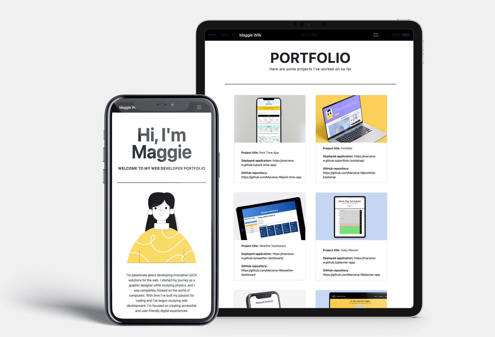

# portfolio-react

# Description
> As part of my web development portfolio, I created a custom-built portfolio site using the  front-end JavaScript library, React. The site was built from scratch, with a focus on modular code that is easy to understand, modify, and extend.

Deployed app: https://marzena-w.github.io/portfolio-react-M/

Key features of my portfolio site include:
1. Responsive design.
2. Clean UI - with a focus on typography, whitespace, and intuitive navigation.
3. Customizable components - To make it easy to modify and add new content to my site, I used React's component-based architecture. This means that each part of the site is encapsulated in a reusable component that can be easily customized or replaced.

## Installation
To install the app, do the following:
1. Clone the repo with git clone Create a .gitignore file and include node_modules/ and .DS_Store/ so that your node_modules directory isn't tracked or uploaded to GitHub. 
2. Install dependencies - Navigate to the directory where you cloned the repository and install the dependencies required by the app by running npm install in your terminal. Additonally install axios and bootstrap for React.
3. Run the app - Once the dependencies have been installed, you can run the app by running npm start in your terminal. This will start a development server that will run the app in your browser. 
4. Customize the app (optional) - If you want to customize the app, you can modify the code by opening the project in a code editor like Visual Studio Code.

## Mockup

